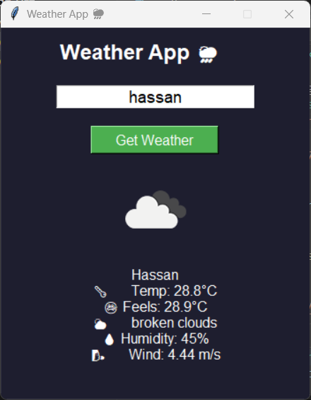

# 🌦️ Weather App using Python

A GUI-based Weather Application built using Python and Tkinter.  
It fetches real-time weather data using OpenWeather APP.

## 🚀 Features
- 🌍 Search weather by city
- 🌡️ Temperature, humidity, wind details
- 🌤️ Weather icons
- 🎨 Clean GUI interface

## 🛠️ Tech Stack
- Python
- Tkinter
- Requests
- OpenWeather API
- 
## 📸 Screenshot


## ▶️ How to Run
```bash
Pip install requests pillow
py weather_gui.py
